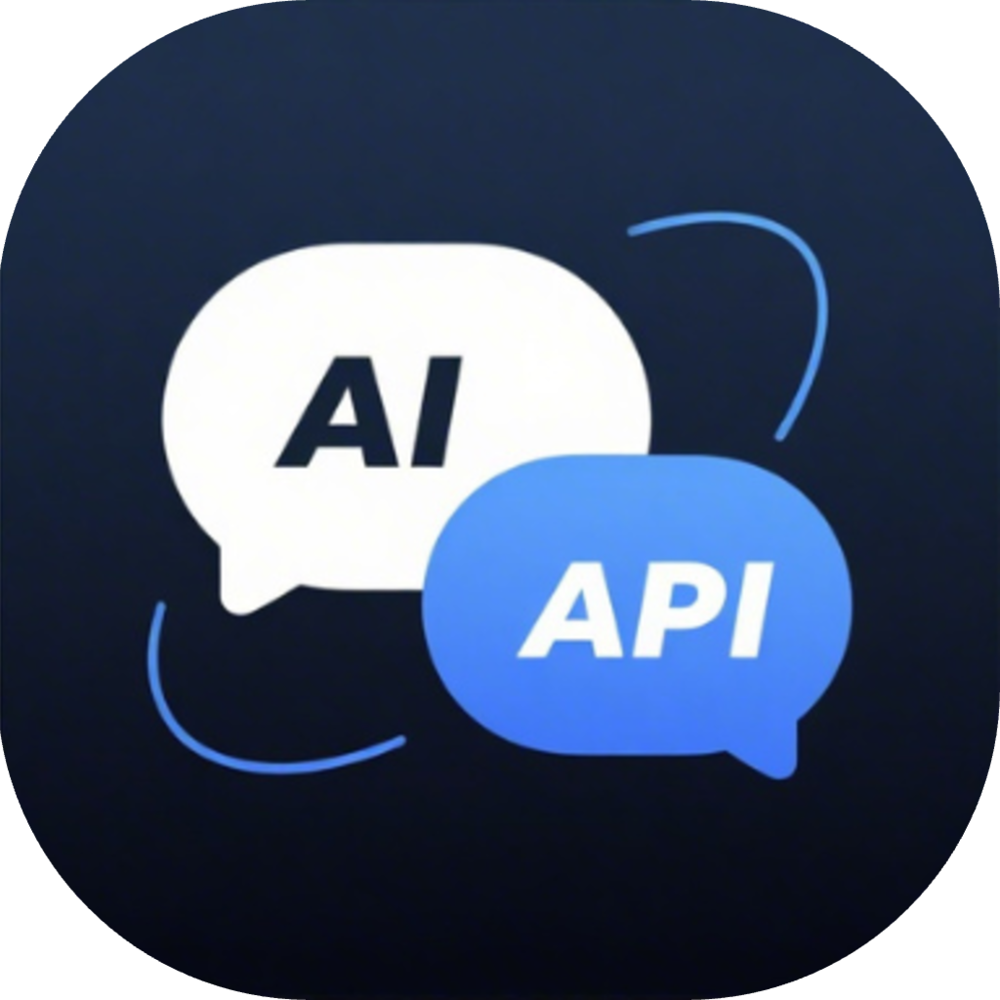
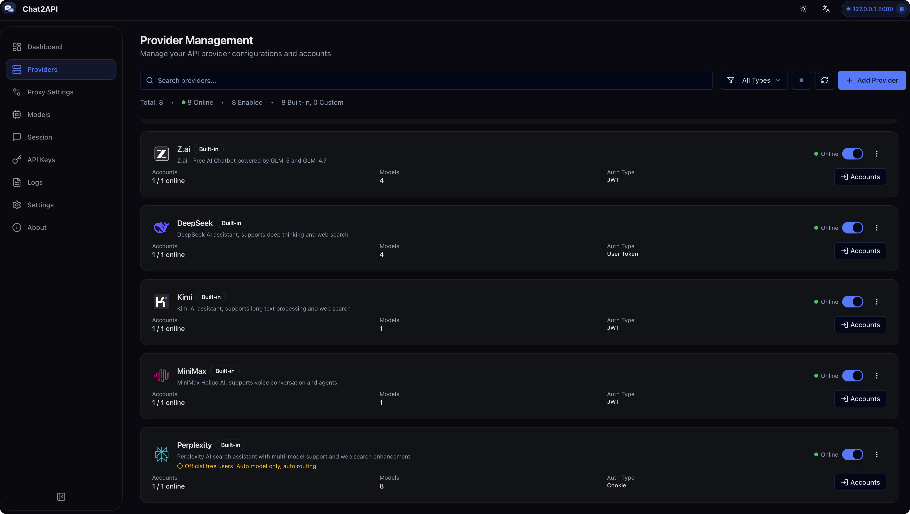
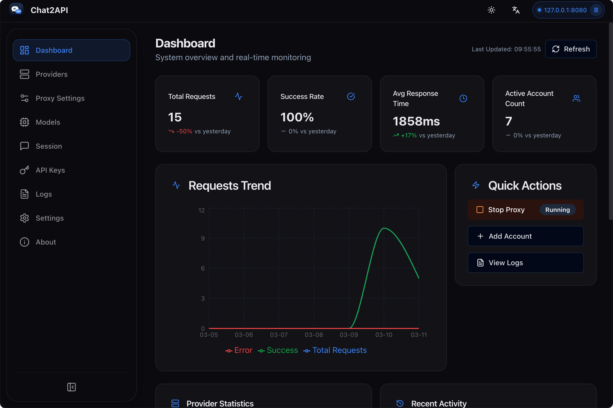
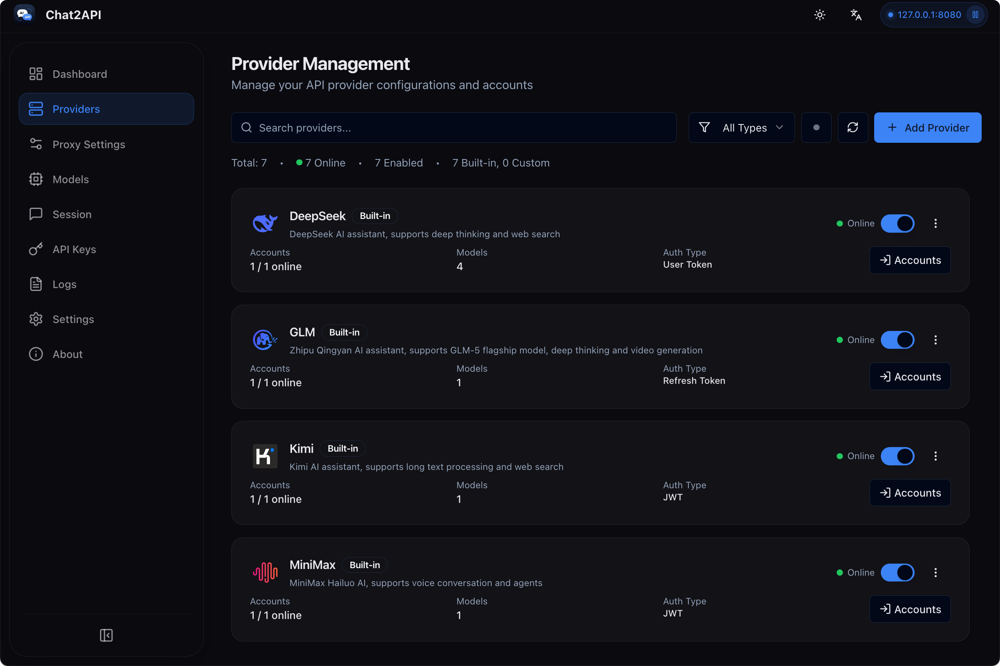
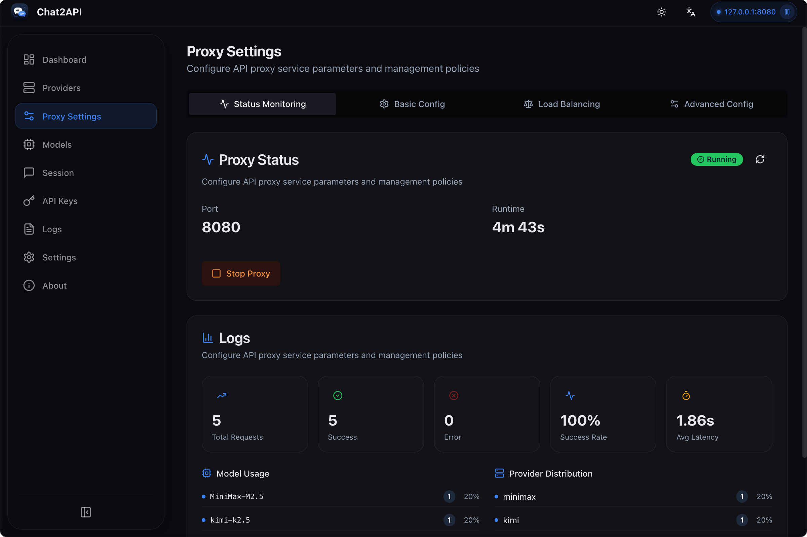
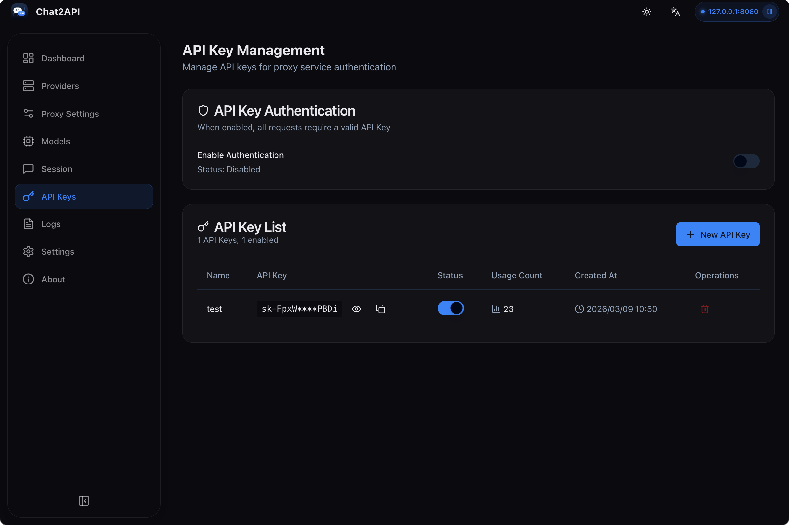
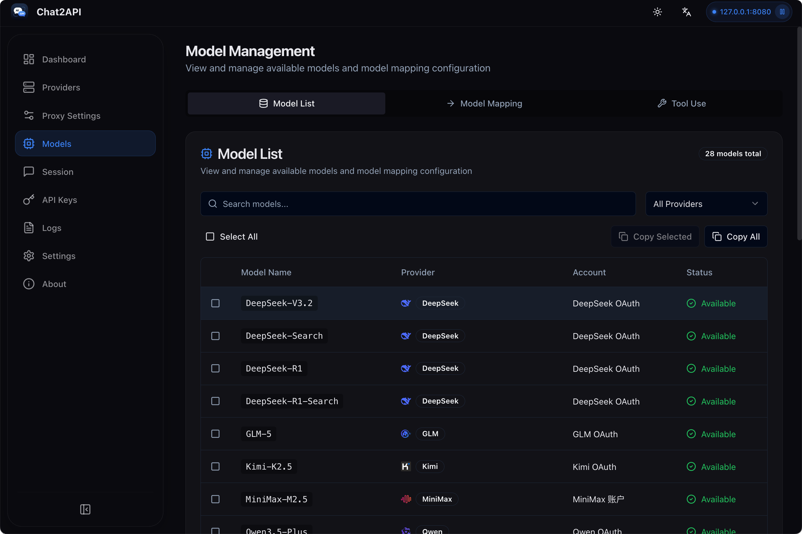
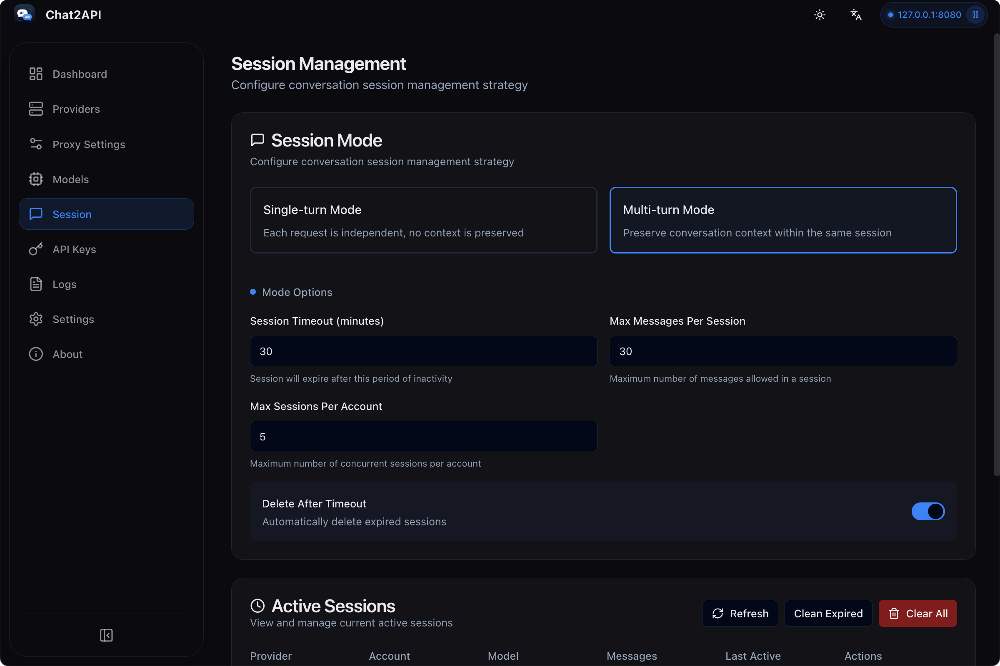

# Chat2API

<p align="center">
  
</p>

<p align="center">
  
  
  <br>
  <a href="https://www.electronjs.org/"></a>
  <a href="https://react.dev/"></a>
  <a href="https://www.typescriptlang.org/"></a>
  
</p>

<p align="center">
  <strong><a href="README.md">English</a> | <a href="https://chat2api-doc.vercel.app/">官网介绍</a> | <a href="https://chat2api-doc.vercel.app/docs">文档</a></strong>
</p>

<p align="center">
  <strong>多平台 AI 服务统一管理工具</strong>
</p>

<p align="center">
  Chat2API 通过驱动各大模型的官方 Web UI，实现 0 成本接入主流 AI 大模型。支持 DeepSeek、GLM、Kimi、MiniMax、Qwen、Z.ai 等渠道，可无缝连接 openlcaw、Cline、Roo-Code 等工具，让任何 OpenAI 兼容客户端即刻可用。
</p>



## ✨ 功能特性

- OpenAI 兼容 API：提供标准 OpenAI 兼容接口，无缝对接现有工具
- 多服务商支持：支持 DeepSeek、GLM、Kimi、MiniMax、Perplexity 🆕、Qwen、Z.ai 等
- 🆕 上下文管理：智能对话上下文管理，支持滑动窗口、Token 限制和总结压缩策略
- 🆕 工具调用支持：通过提示词工程为所有模型提供通用工具调用能力，兼容 Cherry Studio、Kilo Code 等客户端
- 🆕 模型映射：灵活的模型名称映射，支持通配符和首选服务商/账户选择
- 🆕 自定义参数：支持自定义 HTTP Header 开启联网搜索、深度思考、深度研究等功能
- 仪表盘监控：实时请求流量、Token 使用量和成功率统计
- API Key 管理：为本地代理生成和管理密钥
- 模型管理：查看和管理所有服务商的可用模型
- 请求日志：详细的请求日志记录，便于调试和分析
- 代理配置：灵活的代理设置和路由策略
- 系统托盘集成：从菜单栏快速访问状态
- 多语言支持：支持英文和简体中文
- 现代界面：简洁响应式界面，支持深色/浅色主题

## 🤖 支持的服务商

| 服务商           | 认证类型          | OAuth | 模型                                                                                                                                                                                                                                            |
| ------------- | ------------- | ----- | --------------------------------------------------------------------------------------------------------------------------------------------------------------------------------------------------------------------------------------------- |
| DeepSeek      | User Token    | 是     | deepseek-v4-flash, deepseek-v4-pro                                                                                                                                                                                                            |
| GLM           | Refresh Token | 是     | GLM-5.1                                                                                                                                                                                                                                       |
| Kimi          | JWT Token     | 是     | Kimi-K2.6                                                                                                                                                                                                                                     |
| MiniMax       | JWT Token     | 是     | MiniMax-M2.7                                                                                                                                                                                                                                  |
| Mimo          | Cookie        | 是     | MiMo-V2.5-Pro, MiMo-V2.5, MiMo-V2-Flash                                                                                                                                                                                                       |
| Perplexity    | Cookie        | 是     | Auto                                                                                                                                                                                                                                         |
| Qwen (国内版)    | SSO Ticket    | 是     | Qwen3.6, Qwen3.7-Max, Qwen3.5-Flash, Qwen3-Max, Qwen3-Max-Thinking-Preview, Qwen3-Coder                                                                                                                                                       |
| Qwen AI (国际版) | JWT Token     | 是     | Qwen3.7-Max, Qwen3.6-Plus, Qwen3.6-35B-A3B, Qwen3.6-27B, Qwen3-Coder                                                                                                                                                                         |
| Z.ai          | JWT Token     | 是     | 受前端验证码风控限制，暂不可用                                                                                                                                                                                                                              |

供应商适配说明和手动添加模型教程见 [docs/providers](docs/providers/README.md)。

## 📥 安装

### 下载安装

从 [GitHub Releases](https://github.com/xiaoY233/Chat2API/releases) 下载最新版本：

| 平台                    | 下载文件                                   |
| --------------------- | -------------------------------------- |
| macOS (Apple Silicon) | `Chat2API-x.x.x-arm64.dmg`             |
| macOS (Intel)         | `Chat2API-x.x.x-x64.dmg`               |
| Windows               | `Chat2API-x.x.x-x64-setup.exe`         |
| Linux                 | `Chat2API-x.x.x-x64.AppImage` 或 `.deb` |

### 从源码构建

**环境要求：**

- Node.js 18+
- npm
- Git

```bash
# 克隆仓库
git clone https://github.com/xiaoY233/Chat2API.git
cd Chat2API

# 安装依赖
npm install

# 启动开发服务器
npx electron-vite dev 2>&1
```

### 构建生产版本

```bash
npm run build              # 构建应用
npm run build:mac          # 构建 macOS 版本 (dmg, zip)
npm run build:win          # 构建 Windows 版本 (nsis)
npm run build:linux        # 构建 Linux 版本 (AppImage, deb)
npm run build:all          # 构建所有平台
```

## 📖 使用方法

### 步骤 1：启动应用

安装完成后，启动 Chat2API。您将看到主仪表盘。

### 步骤 2：添加供应商

1. 从侧边栏导航到**供应商**页面
2. 点击**添加供应商**按钮
3. 选择一个内置供应商（例如 DeepSeek）
4. 输入您的认证凭证

例如，获取 DeepSeek Token：

1. 访问 [DeepSeek Chat](https://chat.deepseek.com/)
2. 开始任意对话
3. 按 `F12` 打开开发者工具
4. 转到 **Application** > **Local Storage**
5. 找到 `userToken` 并复制其值

### 步骤 3：配置代理

1. 从侧边栏导航到**代理设置**页面
2. 设置端口（默认：8080）
3. 选择负载均衡策略：
   - **轮询**：在账户间均匀分配请求
   - **填充优先**：使用一个账户直到达到限制
   - **故障转移**：失败时自动切换
4. 点击**启动代理**

### 步骤 4：测试 API

使用 Python (OpenAI SDK)：

```python
from openai import OpenAI

client = OpenAI(
    api_key="your-api-key",
    base_url="http://localhost:8080/v1"
)

response = client.chat.completions.create(
    model="deepseek-v4-flash",
    messages=[
        {"role": "user", "content": "你好，你是谁？"}
    ]
)

print(response.choices[0].message.content)
```

### 步骤 5：管理 API Key（可选）

为了安全，您可以启用 API Key 认证：

1. 转到 **API Keys** 页面
2. 点击**新建 API Key**
3. 输入名称和描述
4. 复制生成的密钥

## 📸 截图

| 仪表盘 | 服务商 |
|--------|--------|
|  |  |

| 代理设置 | API Key |
|----------|---------|
|  |  |

| 模型管理 | 会话管理 |
|----------|----------|
|  |  |

## ⚙️ 设置选项

- **端口**：更改代理监听端口（默认：8080）
- **路由策略**：轮询（Round Robin）或填充优先（Fill First）
- **自动启动**：应用启动时自动启动代理
- **主题**：浅色、深色或跟随系统
- **语言**：英文或简体中文

## 🏗️ 项目结构

```
Chat2API/
├── src/
│   ├── main/                    # Electron 主进程
│   │   ├── index.ts            # 应用入口
│   │   ├── tray.ts             # 系统托盘集成
│   │   ├── proxy/              # 代理服务器管理
│   │   ├── ipc/                # IPC 处理器
│   │   └── utils/              # 工具函数
│   ├── preload/                # 上下文桥接
│   └── renderer/               # React 前端
│       ├── components/         # UI 组件
│       ├── pages/              # 页面组件
│       ├── stores/             # Zustand 状态
│       └── hooks/              # 自定义 Hooks
├── build/                      # 构建资源
└── scripts/                    # 构建脚本
```

## 🔧 技术栈

| 组件   | 技术                    |
| ---- | --------------------- |
| 框架   | Electron 33+          |
| 前端   | React 18 + TypeScript |
| 样式   | Tailwind CSS          |
| 状态管理 | Zustand               |
| 构建工具 | Vite + electron-vite  |
| 打包工具 | electron-builder      |
| 服务器  | Koa                   |

## 📁 数据存储

应用数据存储在 `~/.chat2api/` 目录下：

- `config.json` - 应用配置
- `providers.json` - 服务商设置
- `accounts.json` - 账户凭证（加密）
- `logs/` - 请求日志

## ❓ 常见问题

### macOS 提示"应用已损坏，无法打开"？

由于 macOS 的安全机制，非 App Store 下载的应用可能会触发此提示。运行以下命令即可修复：

```bash
sudo xattr -rd com.apple.quarantine "/Applications/Chat2API.app"
```

### 如何更新？

在 **关于** 页面检查更新，或从 [GitHub Releases](https://github.com/xiaoY233/Chat2API/releases) 下载最新版本。

## 🤝 贡献

1. Fork 本项目
2. 创建功能分支 (`git checkout -b feature/amazing-feature`)
3. 提交更改 (`git commit -m 'Add amazing feature'`)
4. 推送到分支 (`git push origin feature/amazing-feature`)
5. 提交 Pull Request

## 📄 许可证

GNU 通用公共许可证 v3.0。详见 [LICENSE](LICENSE)。

这意味着：

- ✅ 可以自由使用、修改和分发
- ✅ 衍生作品必须以相同许可证开源
- ✅ 必须保留原始版权声明

## 🙏 致谢

- [Electron](https://www.electronjs.org/) - 跨平台框架
- [React](https://react.dev/) - UI 框架
- [TypeScript](https://www.typescriptlang.org/) - 类型安全的 JavaScript
- [Tailwind CSS](https://tailwindcss.com/) - CSS 框架
- [Zustand](https://zustand-demo.pmnd.rs/) - 状态管理
- [Koa](https://koajs.com/) - HTTP 服务器
