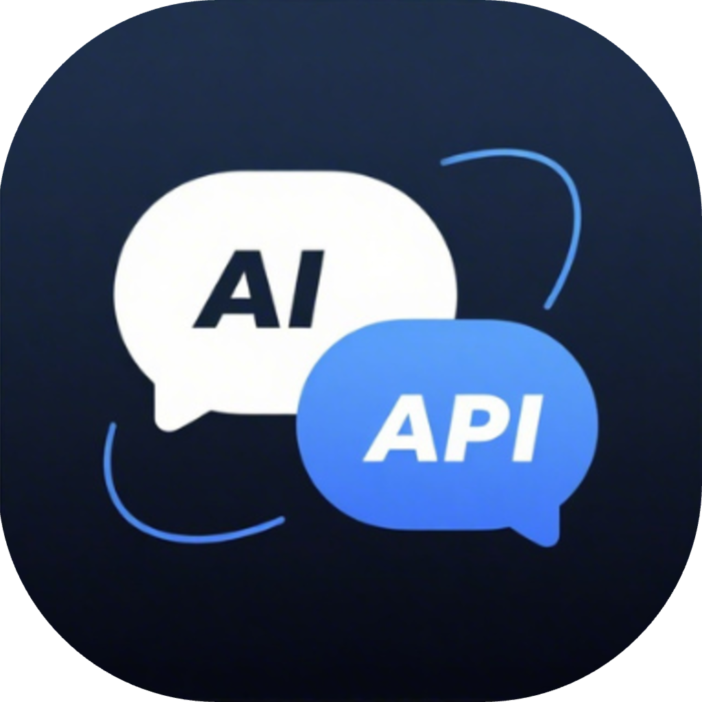

# AFS — AI 服务统一管理器

<p align="center">
  
</p>

<p align="center">
  
  
  <br>
  <a href="https://www.electronjs.org/"></a>
  <a href="https://react.dev/"></a>
  <a href="https://www.typescriptlang.org/"></a>
  
</p>

<p align="center">
  <strong>多平台 AI 服务统一管理工具 · Multi-platform AI Service Unified Management Tool</strong>
</p>

<p align="center">
  AFS（仓库名 AFSplug）是 Chat2API 的增强分支，通过官方 Web UI 零成本接入主流 AI 模型，提供 OpenAI 兼容 API 接口，支持 DeepSeek、GLM、Kimi、MiniMax、Qwen、Z.ai 等提供商，可无缝对接 Hermes、Cline、Roo-Code、Cherry Studio 等任意 OpenAI 兼容客户端。
</p>

## ✨ 功能特性

- **OpenAI 兼容 API**：标准 `/v1/chat/completions` 端点，开箱即用
- **多提供商支持**：DeepSeek、GLM、Kimi、MiniMax、Perplexity、Qwen、Z.ai 等
- **Function Calling**：通过 prompt 工程为所有模型提供通用工具调用能力
- **上下文管理**：滑动窗口、Token 限制、摘要策略
- **模型映射**：通配符模型名映射，支持首选提供商/账号
- **自定义参数**：自定义 HTTP 头，启用联网搜索、思考模式、深度研究
- **仪表盘监控**：实时请求流量、Token 用量、成功率
- **API Key 管理**：为本地代理生成和管理密钥
- **系统托盘**：菜单栏快速访问状态
- **多语言**：英文 / 简体中文
- **现代化 UI**：暗色/亮色主题

## 🆕 本分支新增（v1.6.0）

- **仓库结构扁平化**：移除 `Chat2API/` 中间层，应用代码与配置直接位于仓库根目录；Git 历史经 rename 完整保留，代码、结构与功能不变
- **应用更名为 AFS**：macOS 菜单栏/Dock、Windows 快捷方式与开始菜单、Linux 桌面项，以及窗口标题、托盘菜单、关于页统一显示 **AFS**
- **数据零丢失**：保留 `~/.chat2api/` 数据目录、钥匙串条目（`chat2api Safe Storage`）、localStorage 键与自动更新标识不变，老用户账号与设置无需迁移

### 历史版本要点

- **工具调用参数归一化**（v1.5.9）：新增 `normalizeToolArguments`，将字符串形态的数组参数（如 `web_search.queries`）自动还原为数组，修复 GLM-5.3 等模型因参数类型不符被客户端拦截的故障
- **Schema 驱动工具提取**（v1.5.9）：managed XML 协议新增 `tryExtractSchemaDrivenCalls`，参数标签未被识别时按 JSON Schema 兜底抽取
- **DeepSeek 模型更名**（v1.5.9）：`deepseek-v4-flash` 对外名改为 `DeepSeek-V4.1-Flash`，旧名登记为 legacy 并迁移历史映射
- **Kimi K3 工具调用修复**：provider 切换为 `managed_bracket` 协议，K3 可正常调用工具
- **Kimi reasoning_effort 支持**：模型名后缀自动识别（`-adv` → 进阶/high，`-fast` → 快速/low）
- **Windows 兼容**：脚本中心 Python 解释器自动探测（python3 → python → py）

## 🤖 支持提供商

| Provider         | Auth Type     | OAuth | Models |
| ---------------- | ------------- | ----- | ------ |
| DeepSeek         | User Token    | Yes   | DeepSeek-V4.1-Flash, deepseek-v4-pro |
| GLM              | Refresh Token | Yes   | GLM-5.3, GLM-5.3-thinking |
| Kimi             | JWT Token     | Yes   | Kimi3, Kimi-K3.1 |
| MiniMax          | JWT Token     | Yes   | MiniMax-M2.7 |
| Mimo             | Cookie        | Yes   | MiMo-V2.5-Pro, MiMo-V2.5, MiMo-V2-Flash |
| Perplexity       | Cookie        | Yes   | Auto |
| Qwen (CN)        | SSO Ticket    | Yes   | Qwen3.6, Qwen3.7-Max, Qwen3.5-Flash, Qwen3-Max, Qwen3-Max-Thinking-Preview, Qwen3-Coder |
| Qwen AI (Global) | JWT Token     | Yes   | Qwen3.7-Max, Qwen3.6-Plus, Qwen3.6-35B-A3B, Qwen3.6-27B, Qwen3-Coder |
| Z.ai             | JWT Token     | Yes   | Temporarily unavailable due to frontend captcha risk control |

## 🚀 快速开始

### 开发模式

```bash
npm install
npm run dev          # macOS / Linux
npm run dev:win      # Windows
```

### 构建安装包

```bash
npm run build:mac    # macOS (dmg, zip)
npm run build:win    # Windows (nsis)
npm run build:linux  # Linux (AppImage, deb)
npm run build:all    # 全平台
```

### 自动化发布

打 `v*` 标签触发 GitHub Actions 五平台并行构建：

```bash
git tag v1.6.0
git push origin v1.6.0
```

> 注意：electron-builder 默认创建 Draft Release，发布后需手动执行
> `gh release edit vX.Y.Z --draft=false --latest` 转为正式发布。

## 📁 项目结构

```
AFSplug/
├── src/
│   ├── main/                  # 主进程
│   │   ├── proxy/             # 代理服务器（Koa）+ 提供商适配器
│   │   ├── oauth/             # OAuth 认证
│   │   ├── providers/         # 提供商配置
│   │   ├── store/             # 持久化存储
│   │   └── ipc/               # IPC 通信
│   ├── preload/               # 上下文桥接
│   ├── renderer/              # React 前端
│   └── shared/                # 共享类型
├── scripts/                   # 辅助脚本（GLM token 刷新等）
├── tests/                     # 测试（node:test + 原生 TS 剥离）
├── build/                     # 图标与打包资源
├── docs/                      # 应用文档、截图与提供商说明
├── .github/workflows/release.yml  # 五平台自动构建
└── package.json
```

## 📖 详细文档

- 完整使用说明：[docs/README.md](docs/README.md)（[中文版](docs/README_CN.md)）
- 开发维基：[CODE_WIKI.md](CODE_WIKI.md)
- 代理内部实现：[AGENTS.md](AGENTS.md)

## 💾 数据存储

应用数据存储在 `~/.chat2api/`（目录名沿用历史命名以兼容旧版本数据，应用更名 AFS 后未做迁移）：
- `data.json` — 应用配置、提供商设置与账号凭证（加密）
- `logs/` — 应用日志
- `request-logs/` — 请求日志

## License

GPL-3.0
